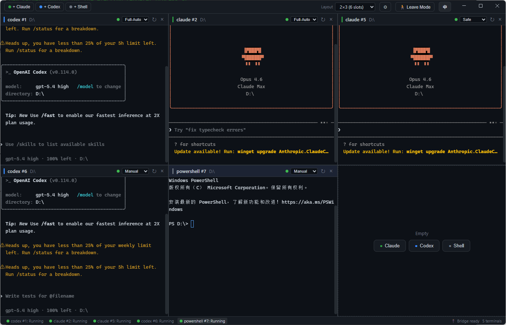
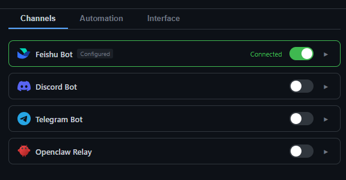

<p align="center">
  
</p>

<h1 align="center">EasyAgentCli</h1>

<p align="center">
  Multi-Pane AI Agent Terminal Manager
</p>

<p align="center">
  <a href="README_zh.md">中文文档</a>
</p>

---

Run AI agents (Claude Code, Codex, etc.) in a multi-pane grid. Monitor and control terminals remotely from Feishu, Discord, Telegram on your phone.



## Features

- **Multi-Pane Terminal Grid** — Run multiple AI agent sessions side by side with resizable panes and flexible layouts (1-9 slots)
- **Multiple Agent Support** — Launch Claude Code, Codex, PowerShell, or any shell in each pane
- **Leave Mode** — Step away from your computer and monitor/control all terminals remotely via messaging apps
- **Remote Adapters** — Connect through Feishu (Lark), Discord, Telegram, or Openclaw relay
- **Smart Notifications** — Configurable heartbeat summaries and idle alerts keep you informed
- **Terminal Features** — Full copy/paste support, auto-fit resize, web link detection, scroll history
- **Session Persistence** — Resume Claude Code sessions across restarts
- **Bilingual UI** — Chinese and English interface

## Quick Start

### Prerequisites

- Node.js 20+
- npm

### Install & Run

```bash
git clone https://github.com/haibindev/EasyAgentCli.git
cd EasyAgentCli
npm install
npm run rebuild   # build native node-pty module
npm run dev
```

### Build

```bash
npm run build
npx electron-builder --win --dir
```

Output: `dist-electron/win-unpacked/`

## Remote Adapter Setup

Click the gear icon in the toolbar to configure adapters.



| Adapter | Required Config |
|---------|----------------|
| Feishu Bot | App ID, App Secret |
| Discord | Bot Token, Channel ID (auto-learned) |
| Telegram | Bot Token, Chat ID (auto-learned) |
| Openclaw | Relay URL |

Enable **Leave Mode** (toolbar toggle) to start forwarding terminal events to your configured channels.

## Remote Commands

When in Leave Mode, send messages to your bot:

| Command | Action |
|---------|--------|
| `#1 your message` | Send input to terminal pane #1 |
| `#2 approve this` | Send input to terminal pane #2 |
| Any text | Sent to the focused / first pane |

## Tech Stack

- **Electron** + **React** + **TypeScript**
- **xterm.js** — terminal emulation
- **node-pty** — native PTY backend
- **electron-vite** — build tooling

## License

[MIT](LICENSE)

## Author

**haibindev** — [https://haibindev.github.io/](https://haibindev.github.io/)
