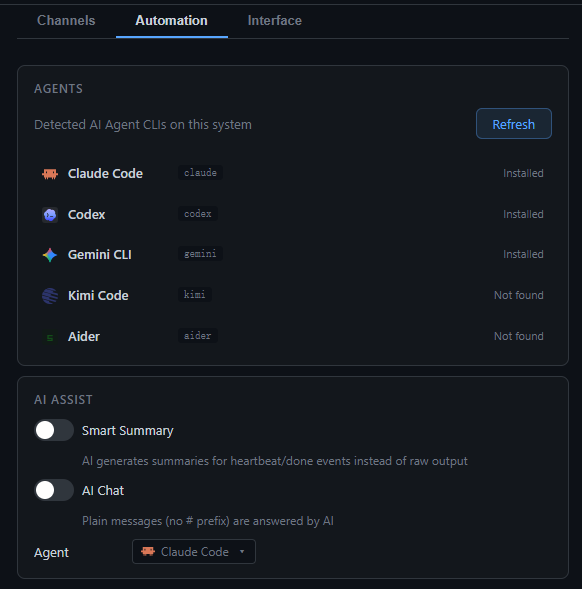

<div align="center">


# EasyAgentCli

Multi-Pane AI Agent Terminal Manager

[](https://electronjs.org)
[](https://reactjs.org)
[](https://typescriptlang.org)
[](LICENSE)
[](https://github.com/haibindev/EasyAgentCli)

[中文文档](README_zh.md)

</div>

---

AI agents work best when left to run — but life doesn't pause for your terminals.

**EasyAgentCli** lets you run Claude Code, Gemini, Kimi, and more side by side in a native multi-pane grid, with full access to every CLI feature. When you need to step away, hit **Leave Mode** — your agents keep running, and you stay in control from your phone via Feishu, Discord, or Telegram.

> No more babysitting terminals. No more missing a confirmation prompt while you're out.  
> Your agents work. You live.


## Why EasyAgentCli?

A typical scenario:

1. You have 3 Claude Code sessions running in parallel, each working on a different repo
2. One of them hits a confirmation prompt — you don't want to stare at the screen
3. **Enable Leave Mode** → go to a meeting / grab lunch / head home
4. Claude needs approval → Feishu / Discord / Telegram pushes a notification to your phone
5. Reply `y` on your phone → the terminal continues
6. Task completes → you get a ✅ notification
7. Send `/screen` anytime to see the terminal, `/log 50` for recent output

**In short: turn your AI agent terminals into a chat conversation on your phone.**

## Features

- **Multi-Pane Terminal Grid** — Run multiple AI agent sessions side by side with flexible layouts (1×1 to 4×4)
- **5 Built-in Agents** — Claude Code, Codex, Gemini CLI, Kimi Code, Aider — auto-detected on startup
- **Leave Mode** — Step away and monitor / control all terminals remotely via messaging apps
- **Remote Adapters** — Feishu (Lark), Discord, Telegram, Openclaw relay
- **Automation** — Configurable heartbeat summaries and idle alerts; optional AI-powered smart summaries and AI chat via any installed agent
- **Session Persistence** — Resume Claude Code and Codex sessions across restarts
- **Terminal Features** — Full copy/paste, auto-fit resize, link detection, scroll history, IME input
- **Bilingual UI** — Chinese / English, switchable at runtime

## Supported Agents

| Agent | Command | Bypass Flag |
|-------|---------|-------------|
| Claude Code | `claude` | `--dangerously-skip-permissions` |
| Codex | `codex` | `--dangerously-bypass-approvals-and-sandbox` |
| Gemini CLI | `gemini` | `--yolo` |
| Kimi Code | `kimi` | `--yolo` |
| Aider | `aider` | `--yes` |

Agents are auto-detected at startup. Go to **Settings → Automation** to see which are installed and refresh the detection.

## Quick Start

### Prerequisites

- Node.js 20+
- npm

### Install & Run

```bash
git clone https://github.com/haibindev/EasyAgentCli.git
cd EasyAgentCli
npm install
npm run rebuild   # build native node-pty module
npm run dev
```

### Build

```bash
npm run build
npx electron-builder --win --dir
```

Output: `dist-electron/win-unpacked/`

## Remote Adapter Setup

Open **Settings → Channels** to configure adapters.


| Adapter | Required Config |
|---------|----------------|
| Feishu Bot | App ID, App Secret |
| Discord | Bot Token, Channel ID (auto-learned) |
| Telegram | Bot Token, Chat ID (auto-learned) |
| Openclaw | Relay URL |

Enable **Leave Mode** (toolbar toggle) to start forwarding terminal events to your configured channels.

## Automation Settings

**Settings → Automation** lets you configure agent detection, AI assist, and notification timing.



- **AGENTS** — See which agent CLIs are installed; click Refresh to re-detect
- **AI ASSIST** — Enable Smart Summary (AI rewrites heartbeat/done events) and AI Chat (plain messages answered by AI)
- **Notification Timing** — Set heartbeat interval and idle timeout; each can be toggled on/off independently

## Remote Commands

When in Leave Mode, send messages to your bot:

| Command | Action |
|---------|--------|
| `#1 your message` | Send input to terminal pane #1 |
| `#2 approve this` | Send input to terminal pane #2 |
| `/screen` | Get a 60-line terminal snapshot |
| `/log [n]` | Get last n lines of output (default 20) |
| `y` or `yes` | Confirm current prompt |
| `n` or `no` | Reject current prompt |
| Any text | Sent to the active / first pane |

## Keyboard Shortcuts

| Shortcut | Action |
|----------|--------|
| `Ctrl+Tab` | Next pane |
| `Ctrl+Shift+Tab` | Previous pane |
| `Ctrl+W` | Close active pane |
| `Ctrl+Shift+R` | Restart active pane |

## Architecture

```
Electron main process
├── index.ts              → window management, IPC, adapter lifecycle
├── pty-manager.ts        → PTY create/restart/destroy, event detection
└── bridge/
    ├── analyzer.ts       → terminal output pattern matching
    ├── message-router.ts → command parsing, event routing
    └── adapters/
        ├── feishu.ts     → Feishu bot
        ├── discord.ts    → Discord bot
        ├── telegram.ts   → Telegram bot
        └── openclaw.ts   → Openclaw WebSocket relay

Renderer (React + xterm.js)
├── App.tsx               → grid layout, state management
└── components/
    ├── Toolbar.tsx       → new pane, layout, settings
    ├── TerminalPane.tsx  → xterm.js terminal wrapper
    ├── StatusBar.tsx     → pane status
    ├── NewPaneDialog.tsx → pane creation dialog
    └── AdapterSettings.tsx → IM adapter config
```

## Tech Stack

| Category | Technology |
|----------|-----------|
| Desktop | Electron 41 |
| UI | React 18 + TypeScript |
| Terminal | xterm.js |
| PTY | node-pty |
| Build | electron-vite |
| Feishu | @larksuiteoapi/node-sdk |
| Discord | discord.js |
| Telegram | Bot API (zero dependencies) |

## Contributing

Issues and PRs are welcome!

- [Report a bug](https://github.com/haibindev/EasyAgentCli/issues) or suggest a feature
- Give the project a ⭐ Star if you find it useful

## License

[MIT](LICENSE)

## Author

**haibindev** — [https://haibindev.github.io/](https://haibindev.github.io/)
