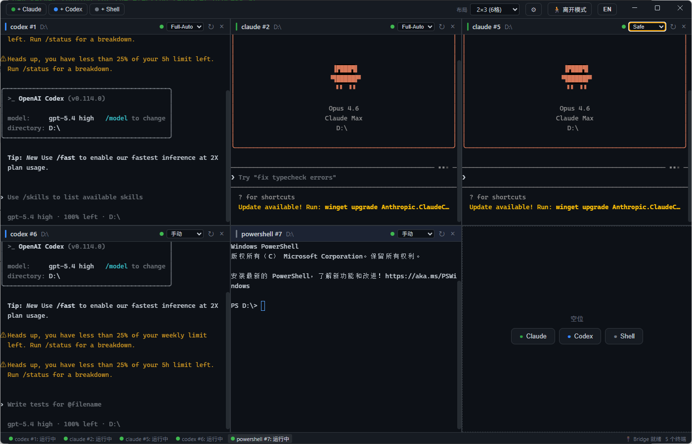
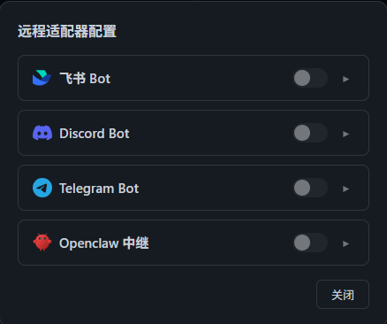

<div align="center">

# EasyAgentCli

**让 Claude Code、Codex 和 Shell 并排运行。**

[](https://electronjs.org)
[](https://reactjs.org)
[](https://typescriptlang.org)
[](LICENSE)

面向 AI 编程工作流的多窗格终端管理器。
在可配置的网格布局中管理多个 Agent 会话，支持通过飞书、Discord、Telegram 或 Openclaw 远程控制。

[English](README.md)

</div>

---

## 为什么选择 EasyAgentCli？

AI 编程助手都运行在终端里——但在多个标签页之间来回切换很快就会变得混乱。EasyAgentCli 让你在**一个窗口**里并排管理所有 Agent，内置智能自动化和远程监控。

- 一键启动 **Claude Code**、**Codex** 或普通 **Shell** 会话
- 以**矩阵网格**排列（1×1 到 4×4）——无需手动调整大小
- 让 **YOLO 自动应答**帮你处理确认操作，专注于真正重要的事
- 离开工位后通过**飞书 / Discord / Telegram / Openclaw** 在手机上监控一切

## 截图



<details>
<summary>适配器设置</summary>



</details>

## 功能特性

<table>
<tr>
<td width="50%">

### 🖥️ 多窗格网格
可配置的矩阵布局，从 1×1 到 4×4。CSS Grid 确保稳定渲染——新增或关闭窗格时不会闪烁。超出容量时自动扩展行数。

### 🤖 AI Agent 支持
原生支持 Claude Code 和 Codex。同时可启动任意 Shell 变体：CMD、PowerShell、Git Bash 或 WSL。

### ⚡ YOLO 自动应答
三级自动化：
- **手动** — 所有操作都需确认
- **安全** — 自动同意，阻止危险操作
- **全自动** — 自动同意所有操作

</td>
<td width="50%">

### 📡 远程控制
离开工位后继续掌控一切。终端事件（确认请求、任务完成、错误）会转发到你的 IM。直接回复即可同意、拒绝或发送命令。

### 🔍 智能检测
自动检测确认提示、任务完成、错误和空闲超时。状态徽章实时更新。

### 💾 会话持久化
窗格配置在应用重启后自动恢复。适配器凭据安全存储在本地。

</td>
</tr>
</table>

## 快速开始

```bash
# 克隆并安装
git clone https://github.com/haibindev/EasyAgentCli.git
cd EasyAgentCli
npm install

# 开发模式
npm run dev

# 生产构建
npm run build
```

> **系统要求：** Node.js 18+，npm。Electron 二进制文件会自动下载。

## 快捷键

| 快捷键 | 操作 |
|--------|------|
| `Ctrl+Shift+C` | 新建 Claude Code 窗格 |
| `Ctrl+Shift+X` | 新建 Codex 窗格 |
| `Ctrl+Shift+S` | 新建 Shell 窗格 |
| `Ctrl+Shift+R` | 重启当前窗格 |
| `Ctrl+Tab` | 切换到下一个窗格 |
| `Ctrl+Shift+Tab` | 切换到上一个窗格 |
| `Ctrl+W` | 关闭当前窗格 |

## 远程控制

### 离开模式

点击工具栏中的**「🚶 离开模式」**开启。终端事件会转发到所有已连接的 IM 适配器。你可以在手机上同意、拒绝或发送命令。

### 支持的适配器

| 适配器 | 连接方式 | 认证 |
|--------|---------|------|
| **飞书** | WebSocket（无需公网 URL） | App ID + App Secret |
| **Discord** | Gateway 连接 | Bot Token |
| **Telegram** | 长轮询（无需 Webhook） | Bot Token（@BotFather） |
| **Openclaw** | WebSocket 客户端 → 中继服务器 | 中继 URL |

通过工具栏的 ⚙ 按钮配置适配器。

### 远程命令

| 命令 | 说明 |
|------|------|
| `/panes` | 列出所有终端 |
| `/use <id>` | 切换活动终端 |
| `/screen` | 60 行屏幕快照 |
| `/log [n]` | 最后 n 行日志（默认 20） |
| `/yolo [off\|safe\|full]` | 查看/设置自动化级别 |
| `y` 或 `同意` | 确认当前操作 |
| `n` 或 `拒绝` | 拒绝当前操作 |
| *其他文本* | 直接发送到终端 |

## 架构

```
Electron 主进程
├── index.ts              → 窗口管理、IPC、适配器生命周期
├── pty-manager.ts        → PTY 创建/重启/销毁、事件检测
└── bridge/
    ├── analyzer.ts       → 终端输出模式匹配
    ├── server.ts         → WebSocket 服务器 (:18765)
    ├── discovery.ts      → UDP 多播发现 (:18766)
    ├── message-router.ts → 命令解析、事件路由
    └── adapters/
        ├── feishu.ts     → 飞书机器人 (@larksuiteoapi/node-sdk)
        ├── discord.ts    → Discord 机器人 (discord.js)
        ├── telegram.ts   → Telegram 机器人 (HTTP 长轮询)
        └── openclaw.ts   → Openclaw WebSocket 中继

渲染进程 (React + xterm.js)
├── App.tsx               → 网格布局、状态管理
├── components/
│   ├── Toolbar.tsx       → 新建窗格、布局选择、设置
│   ├── TerminalPane.tsx  → xterm.js 终端封装
│   ├── StatusBar.tsx     → 窗格状态、Bridge 信息
│   ├── NewPaneDialog.tsx → 窗格创建对话框
│   └── AdapterSettings.tsx → IM 适配器配置
└── types.ts
```

## 技术栈

| 分类 | 技术 |
|------|------|
| 桌面框架 | Electron 41 |
| UI | React 18 + TypeScript |
| 终端 | xterm.js |
| PTY | node-pty（预编译二进制） |
| 构建 | electron-vite |
| WebSocket | ws |
| 飞书 | @larksuiteoapi/node-sdk |
| Discord | discord.js |
| Telegram | Bot API（零依赖） |

## 开源协议

MIT © [haibindev](https://github.com/haibindev)
