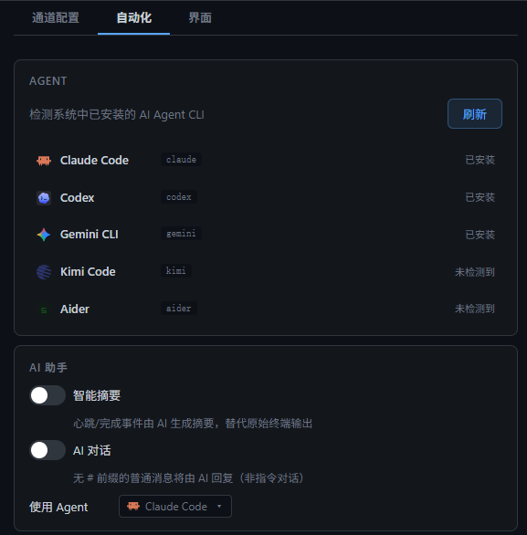

<p align="center">
  
</p>

<h1 align="center">EasyAgentCli</h1>

<p align="center">
  多窗格 AI Agent 终端管理器
</p>

<p align="center">
  <a href="README.md">English</a>
</p>

---

AI Agent 最适合放手让它跑——但现实生活不会等你守着屏幕。

**EasyAgentCli** 让你在原生多窗格界面中并排运行 Claude Code、Gemini、Kimi 等 Agent，完整使用每个 CLI 的原生功能。需要外出时，一键开启**离开模式**——Agent 继续跑，你通过手机上的飞书、Discord 或 Telegram 随时监控、随时操作。

> 再也不怕临时外出，让任务卡在一个确认框。
> 再也不怕守着屏幕等结果，错过了生活里的每一刻。
> Agent 干活，你自由。


## 功能特性

- **多窗格终端网格** — 多个 AI Agent 会话并排运行，支持 1×1 至 4×4 灵活布局
- **5 种内置 Agent** — Claude Code、Codex、Gemini CLI、Kimi Code、Aider，启动时自动检测
- **离开模式** — 离开电脑后，通过即时通讯应用远程监控和操作所有终端
- **远程适配器** — 支持飞书、Discord、Telegram、Openclaw 中继
- **自动化** — 可配置心跳摘要和静默提醒；支持 AI 智能摘要和 AI 对话（通过已安装的 Agent）
- **会话持久化** — 重启后可恢复 Claude Code 和 Codex 会话
- **终端功能** — 完整复制粘贴、自动适配大小、链接检测、滚动历史、中文输入法支持
- **双语界面** — 中英文随时切换

## 支持的 Agent

| Agent | 命令 | 跳过权限参数 |
|-------|------|------------|
| Claude Code | `claude` | `--dangerously-skip-permissions` |
| Codex | `codex` | `--dangerously-bypass-approvals-and-sandbox` |
| Gemini CLI | `gemini` | `--yolo` |
| Kimi Code | `kimi` | `--yolo` |
| Aider | `aider` | `--yes` |

启动时自动检测已安装的 Agent。可在**设置 → 自动化**中查看安装状态并手动刷新。

## 快速开始

### 环境要求

- Node.js 20+
- npm

### 安装与运行

```bash
git clone https://github.com/haibindev/EasyAgentCli.git
cd EasyAgentCli
npm install
npm run rebuild   # 编译原生 node-pty 模块
npm run dev
```

### 打包

```bash
npm run build
npx electron-builder --win --dir
```

输出目录：`dist-electron/win-unpacked/`

## 远程适配器配置

打开**设置 → 通道配置**进行适配器配置。


| 适配器 | 所需配置 |
|--------|---------|
| 飞书 Bot | App ID、App Secret |
| Discord | Bot Token、Channel ID（自动学习） |
| Telegram | Bot Token、Chat ID（自动学习） |
| Openclaw | 中继 URL |

开启工具栏的**离开模式**后，终端事件将转发到已配置的通道。

## 自动化设置

**设置 → 自动化**可配置 Agent 检测、AI 助手和通知策略。



- **AGENT** — 查看已安装的 Agent CLI；点击"刷新"重新检测
- **AI 助手** — 开启智能摘要（AI 重写心跳/完成事件输出）和 AI 对话（普通消息由 AI 回复）
- **通知策略** — 设置心跳间隔和静默超时，每项均可单独开关

## 远程指令

离开模式下，向机器人发送消息：

| 指令 | 说明 |
|------|------|
| `#1 你的消息` | 发送输入到终端窗格 #1 |
| `#2 同意执行` | 发送输入到终端窗格 #2 |
| 任意文本 | 发送到当前焦点 / 第一个窗格 |

## 键盘快捷键

| 快捷键 | 功能 |
|--------|------|
| `Ctrl+Tab` | 切换到下一个窗格 |
| `Ctrl+Shift+Tab` | 切换到上一个窗格 |
| `Ctrl+W` | 关闭当前窗格 |
| `Ctrl+Shift+R` | 重启当前窗格 |

## 技术栈

- **Electron** + **React** + **TypeScript**
- **xterm.js** — 终端模拟
- **node-pty** — 原生 PTY 后端
- **electron-vite** — 构建工具

## 许可证

[MIT](LICENSE)

## 作者

**haibindev** — [https://haibindev.github.io/](https://haibindev.github.io/)

### 关注公众号

关注「**海滨code**」公众号，获取更多 AI 开发工具和技术分享。


